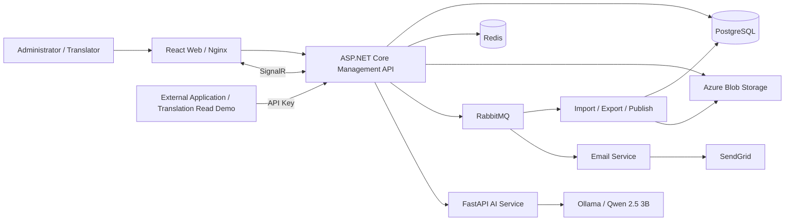

# Translation Management Platform

A multilingual translation management system for internal enterprise applications, covering content organization, editing, review, releases, version management, and API-based delivery.

**Author:** Trần Khiết Lôi

## Component documentation

| Component | Documentation | Scope |
| --- | --- | --- |
| Backend | [Backend README](services/backend/README.md) | .NET architecture, business workflows, APIs, database, queues, configuration, tests |
| Frontend | [Frontend README](apps/web/README.md) | Administration UI, authentication, realtime features, web builds |
| AI | [AI README](services/ai-translation/README.md) | FastAPI, Ollama, model setup, suggestion APIs, limitations |
| Integration example | [Translation Read README](examples/translation-read/README.md) | Reading translations and checking versions/packages with API Keys |

## 1. Purpose and scope

The platform centralizes multilingual content. Administrators organize projects and access permissions; translators edit content; reviewers approve translations; external applications consume the active release.

Main capabilities:

- Manage accounts, profiles, roles, and permissions.
- Manage projects, members, languages, and namespaces.
- Manage translation keys and values through a searchable, filterable, paginated grid.
- Submit, approve, reject, and update translations individually or in batches.
- Import/export JSON, CSV, and XLSX using background processing.
- Publish releases, inspect history, compare versions, and roll back the active release.
- Manage applications and API Keys for translation and package delivery.
- Send email and realtime notifications; display presence and editing locks.
- Generate single and batch translation suggestions through Ollama using `qwen2.5:3b`.

## 2. System architecture



The Management API follows Clean Architecture with Domain, Application, Infrastructure, and API layers. Business requests use CQRS/MediatR. Import/export/publish consumers currently run inside the Management API host. Email runs in a separate host; AI runs as a Python service accessed over HTTP.

## 3. Technology stack

| Area | Technologies |
| --- | --- |
| Backend | .NET 10, ASP.NET Core, EF Core, PostgreSQL, DbUp |
| Design | Clean Architecture, CQRS, MediatR, Repository, Unit of Work |
| Validation and access control | FluentValidation, JWT, refresh tokens, roles/permissions, API Keys |
| Infrastructure | Redis, RabbitMQ, MassTransit, Azure Blob Storage |
| Realtime and observability | SignalR, Serilog, Audit Log, Usage Log |
| Email | SendGrid, Scriban |
| Frontend | React 19, Vite 8, React Router, TanStack Query, Axios, Bootstrap |
| AI | Python, FastAPI, Pydantic, Ollama, `qwen2.5:3b` |
| Packaging | Docker, Docker Compose, Nginx |
| Backend unit tests | xUnit, Moq |

Exact dependency versions are defined in each component's `.csproj`, `package.json`, `package-lock.json`, and `requirements.txt` files.

## 4. Repository structure

```text
Translation-management-platform/
├── apps/web/                   # Administration frontend
├── services/
│   ├── backend/                # Management API, Email, Migration, Shared, Tests
│   └── ai-translation/         # FastAPI and Ollama integration
├── examples/
│   ├── translation-read/       # Translation, version, and package demo
│   └── package-download/       # Separate package download example
├── infra/                      # Local infrastructure Compose
├── docs/                       # Additional documentation
├── scripts/                    # Supporting scripts
└── compose.yaml                # API, Email, Web, Redis, RabbitMQ
```

## 5. Business workflows

| Problem | Implementation |
| --- | --- |
| Authentication | JWT, refresh tokens, email verification, password reset with `PasswordVersion` |
| Authorization | User roles/permissions; API Keys and permissions for external applications |
| Content organization | Project → namespace → key → language-specific value |
| Grid and filtering | Project, namespace, keyword, status, and pagination queries |
| Import/export | Format-specific parsers/generators, Azure Blob, background consumers |
| Publishing/versioning | Releases, packages, history, diffs, and active-release rollback |
| Caching and coordination | Redis for permissions/tokens/security stamps; distributed publish locks |
| Realtime collaboration | SignalR notifications, presence, editing locks, and progress |
| AI assistance | Single/batch FastAPI suggestions followed by the regular review workflow |

Typical flow:

```text
Create project → Configure languages and members → Create/import keys and values
→ Edit or request AI suggestions → Submit → Review/Reject
→ Publish release → External applications read translations using API Keys
```

Statuses include `Missing`, `Draft`, `Translated`, `Rejected`, `Reviewed`, and `Published`. Rollback switches the release being served; it does not restore all working translation data to an earlier point in time.

## 6. Local development

### Prerequisites

- .NET SDK 10 and PostgreSQL.
- Node.js matching the Vite lockfile requirement: `^20.19.0 || >=22.12.0`; Node 22.12+ is an option.
- Docker/Compose for Redis and RabbitMQ.
- Azure Blob Storage and SendGrid for file/email features.
- Python 3.10+ and Ollama for AI suggestions.

### Startup order

Run these commands from the repository root:

```powershell
# 1. Start Redis, RabbitMQ, and RedisInsight.
docker compose -f infra/compose.yaml up -d

# 2. Restore and build the backend.
dotnet restore services/backend/MySolution.slnx
dotnet build services/backend/MySolution.slnx --no-restore
```

Configure PostgreSQL, JWT, Redis, RabbitMQ, Blob, and email, then run DbUp using the [Backend instructions](services/backend/README.md#8-local-development). Run migrations before using the application.

Start each host in a separate configured terminal:

```powershell
dotnet run --project services/backend/Management/MySolution.Api/MySolution.Api.csproj --launch-profile http
```

```powershell
dotnet run --project services/backend/Email/MySolution.Email.Api/MySolution.Email.Api.csproj --launch-profile http
```

```powershell
Set-Location apps/web
npm ci
# Create .env.local as described in the Frontend README.
npm run dev
```

Start AI using the [AI instructions](services/ai-translation/README.md) when suggestions are required. Run the [Translation Read demo](examples/translation-read/README.md) separately on port 5174.

### Development addresses

| Component | Address |
| --- | --- |
| Vite frontend | `http://localhost:5173` if the port is available |
| Management API | `http://localhost:5182` |
| Backend Swagger | `http://localhost:5182/swagger` |
| Email host | `http://localhost:5188` |
| FastAPI Swagger | `http://localhost:8000/docs` |
| RabbitMQ UI with infrastructure Compose | `http://localhost:15672` |
| RedisInsight with infrastructure Compose | `http://localhost:5540` |

**API URL distinction:** the administration frontend uses `VITE_API_URL=http://localhost:5182/api`; Translation Read uses `VITE_API_URL=http://localhost:5182`. Backend CORS must allow each client's actual origin.

## 7. Docker Compose

The root `compose.yaml` declares `redis`, `rabbitmq`, `api`, `email`, and `web`. After configuring connections and required environment variables:

```powershell
docker compose up -d --build
```

The current root Compose maps Web to `http://localhost:5173` and RabbitMQ Management to `http://localhost:15674`. Nginx forwards `/api`, `/hubs`, and `/swagger` to the API on the Docker network.

PostgreSQL and AI are not included as services in root Compose. Provide reachable external endpoints, plus Azure Blob and SendGrid configuration. Avoid running both Compose stacks when ports/resources conflict. Compose `.env` and Vite `.env.local` belong to different configuration mechanisms.

## 8. Validation and testing

```powershell
dotnet test services/backend/MySolution.slnx
```

Run `npm run lint` and `npm run build` in each React application. AI provides `/health` and Swagger for manual checks; `/health` does not check Ollama or the model.

The most recent Auth test run passed 19 Login/Register/ResetPassword cases. Email still contains a placeholder test. This documentation does not claim complete integration-test coverage or successful execution of every command in every environment.

## 9. Current limitations

- Presence and editing locks are held in API memory; multiple instances require shared state and SignalR configuration.
- AI calls synchronous `ollama.chat` from `async` methods; `context` is not yet included in the prompt. Suggestions require review.
- AI `requirements.txt` does not declare `ollama`; its README includes an additional installation step.
- The browser API Key demo is intended for integration testing. Keys are visible to the client and Network Inspector.
- Further work includes integration tests, operational monitoring, secret management, and background-task idempotency.

## 10. Git and related documentation

Imported source history is retained in the rewritten local branches. Use `git branch -a` and `git log --all --graph --oneline` to inspect the refs available in this checkout.

[Deployment configuration](docs/deployment.md) and the [Docker guide](docs/docker.md) describe the current local setup. See [LICENSE](LICENSE) for the repository's license information.

## Private configuration and publishing

Sensitive values have been removed from the local source history and exported outside this repository. Tracked backend settings contain empty credential fields; load private environment variables or use ignored Docker overrides as described in [deployment configuration](docs/deployment.md). The local history rewrite has not been pushed to a remote. See [cleanup status and publication steps](docs/environment-security-review.md).

Run `python scripts/check-secrets.py --history` before publishing. Keep private archives and loader scripts outside the repository.
