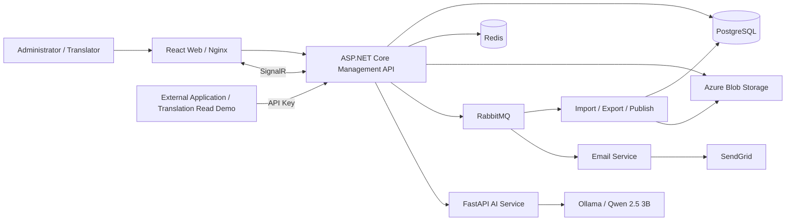

# Translation Management Platform

A multilingual translation management system for internal enterprise applications, covering content organization, editing, review, releases, version management, and API-based delivery.

**Author:** Trần Khiết Lôi

## Component documentation

| Component | Documentation | Scope |
| --- | --- | --- |
| Backend | [Backend README](services/backend/README.md) | .NET architecture, business workflows, APIs, database, queues, configuration, tests |
| Frontend | [Frontend README](apps/web/README.md) | Administration UI, authentication, realtime features, web builds |
| AI | [AI README](services/ai-translation/README.md) | FastAPI, Ollama, model setup, suggestion APIs, limitations |
| Integration example | [Translation Read README](examples/translation-read/README.md) | Reading translations and checking versions/packages with API Keys |

## 1. Purpose and scope

The platform centralizes multilingual content. Administrators organize projects and access permissions; translators edit content; reviewers approve translations; external applications consume the active release.

Main capabilities:

- Manage accounts, profiles, roles, and permissions.
- Manage projects, members, languages, and namespaces.
- Manage translation keys and values through a searchable, filterable, paginated grid.
- Submit, approve, reject, and update translations individually or in batches.
- Import/export JSON, CSV, and XLSX using background processing.
- Publish releases, inspect history, compare versions, and roll back the active release.
- Manage applications and API Keys for translation and package delivery.
- Send email and realtime notifications; display presence and editing locks.
- Generate single and batch translation suggestions through Ollama using `qwen2.5:3b`.

## 2. System architecture



The Management API follows Clean Architecture with Domain, Application, Infrastructure, and API layers. Business requests use CQRS/MediatR. Import/export/publish consumers currently run inside the Management API host. Email runs in a separate host; AI runs as a Python service accessed over HTTP.

## 3. Technology stack

| Area | Technologies |
| --- | --- |
| Backend | .NET 10, ASP.NET Core, EF Core, PostgreSQL, DbUp |
| Design | Clean Architecture, CQRS, MediatR, Repository, Unit of Work |
| Validation and access control | FluentValidation, JWT, refresh tokens, roles/permissions, API Keys |
| Infrastructure | Redis, RabbitMQ, MassTransit, Azure Blob Storage |
| Realtime and observability | SignalR, Serilog, Audit Log, Usage Log |
| Email | SendGrid, Scriban |
| Frontend | React 19, Vite 8, React Router, TanStack Query, Axios, Bootstrap |
| AI | Python, FastAPI, Pydantic, Ollama, `qwen2.5:3b` |
| Packaging | Docker, Docker Compose, Nginx |
| Backend unit tests | xUnit, Moq |

Exact dependency versions are defined in each component's `.csproj`, `package.json`, `package-lock.json`, and `requirements.txt` files.

## 4. Repository structure

```text
Translation-management-platform/
├── apps/web/                   # Administration frontend
├── services/
│   ├── backend/                # Management API, Email, Migration, Shared, Tests
│   └── ai-translation/         # FastAPI and Ollama integration
├── examples/
│   ├── translation-read/       # Translation, version, and package demo
│   └── package-download/       # Separate package download example
├── infra/                      # Infrastructure and private Docker configuration
├── docs/                       # Additional documentation
├── scripts/                    # Supporting scripts
└── compose.yaml                # API, Email, Web, Redis, RabbitMQ, Ollama, AI, demo
```

## 5. Business workflows

| Problem | Implementation |
| --- | --- |
| Authentication | JWT, refresh tokens, email verification, password reset with `PasswordVersion` |
| Authorization | User roles/permissions; API Keys and permissions for external applications |
| Content organization | Project → namespace → key → language-specific value |
| Grid and filtering | Project, namespace, keyword, status, and pagination queries |
| Import/export | Format-specific parsers/generators, Azure Blob, background consumers |
| Publishing/versioning | Releases, packages, history, diffs, and active-release rollback |
| Caching and coordination | Redis for permissions/tokens/security stamps; distributed publish locks |
| Realtime collaboration | SignalR notifications, presence, editing locks, and progress |
| AI assistance | Single/batch FastAPI suggestions followed by the regular review workflow |

Typical flow:

```text
Create project → Configure languages and members → Create/import keys and values
→ Edit or request AI suggestions → Submit → Review/Reject
→ Publish release → External applications read translations using API Keys
```

Statuses include `Missing`, `Draft`, `Translated`, `Rejected`, `Reviewed`, and `Published`. Rollback switches the release being served; it does not restore all working translation data to an earlier point in time.

## 6. Run from a fresh clone

This guide covers a first-time clone or a new local environment on Windows. Docker builds the application components, so you do not need .NET, Node.js, or Python installed on the host when you use the Docker migration option below.

Run the commands in PowerShell from the repository root unless a step says otherwise.

### Step 0: Prerequisites

- Git to clone the repository.
- Docker Desktop running with Linux containers.
- A reachable PostgreSQL server, either installed on Windows or running in a separate container. **The root `compose.yaml` does not start PostgreSQL.** If using a separate container, publish its PostgreSQL port to the host for the connection examples below.
- Azure Blob Storage for uploads, import/export, and release packages; SendGrid with a verified sender for email workflows.
- Optional: .NET SDK 10 on the host if you choose the host migration command instead of the Docker SDK image.

### Step 1: Clone the repository

```powershell
git clone https://github.com/KhietLoi/Translation-management-platform.git
cd Translation-management-platform
```

### Step 2: Generate local configuration

```powershell
powershell -ExecutionPolicy Bypass -File .\scripts\init-docker.ps1
```

The script creates `infra/docker/api.local.json` and `infra/docker/email.local.json` from the tracked `appsettings.json` templates, preserving existing local files. New files contain the configuration structure and defaults, with credential fields left empty. The script also generates `RABBITMQ_PASSWORD` in the root `.env` if that setting is absent.

These files are excluded by `.gitignore`. Keep real values in these local files rather than editing the tracked templates.

### Step 3: Fill in the required settings

The paths in this table are relative to the repository root. Keep the other defaults from the generated templates unless your environment requires changes.

| Setting | File | Required for | Behavior when missing |
| --- | --- | --- | --- |
| `Jwt:SecretKey` | `infra/docker/api.local.json` | Management API startup and token signing | An empty key prevents API startup. Generate your own random secret with at least 32 ASCII characters for the current HS256 signing algorithm. This is not a key obtained from an external provider. |
| `ConnectionStrings:DefaultConnection` | `infra/docker/api.local.json` | Database-backed operations | Login, projects, and other database operations fail without a working connection and migrated schema. |
| `AzureBlob:ConnectionString`, `AzureBlob:ContainerName` | `infra/docker/api.local.json` | Blob-dependent features | The Blob service is constructed when resolved, rather than validated at startup. Missing configuration breaks operations that resolve it, including uploads, import/export, and release-package generation/download. |
| `SendGrid:ApiKey`, `SendGrid:FromEmail`, `SendGrid:FromName` | `infra/docker/email.local.json` | Email service startup and delivery | The Email host validates these fields on startup and fails when they are empty. Successful delivery also requires a valid key and verified sender. |
| `Redis:ConnectionString`, `RabbitMq:*`, `AI:BaseUrl` | Supplied by Compose | Internal service connections | Compose sets Redis to `redis:6379`, RabbitMQ host/user/password, and the API's AI URL to `http://ai-translation:8000`. Keep the generated RabbitMQ password nonempty. |
| Seq API key and Microsoft Teams webhook | `infra/docker/api.local.json` | Optional logging integrations | Not required for this setup; Compose disables these integrations for the API. |
| Application API Key | Created through the administration UI after startup | Translation Read demo and external applications | Not required to start the application. Create a key for the target application and grant the required read permissions. |

Example PostgreSQL connection string for the **API container**, using PostgreSQL on the Windows host:

```text
Host=host.docker.internal;Port=5432;Database=mysolution_db;User Id=postgres;Password=<postgres-password>;Search Path=mysolution
```

Replace `<postgres-password>` with your local PostgreSQL password. Use your server's actual hostname and port if PostgreSQL runs elsewhere. A host process uses `localhost` to reach a local database; a container uses `host.docker.internal` to reach that same database on Windows.

**Without SendGrid:** you can try the core application using the already verified seed accounts and omit the `email` service as shown in Step 5. Registration may create an account and enqueue a message, but a newly registered account must verify its email before login. Password reset also requires email delivery.

### Step 4: Create the database and seed data

**Run migration before starting the application.** Choose one of the following options; you do not need to run both. The database account must have permission to create the database when `CreateNewDatabase=true`, or the database must be created separately.

**Option A: Use the .NET SDK 10 Docker image**

No .NET SDK installation on the host is needed. Run this from the repository root:

```powershell
docker run --rm `
  -v "${PWD}/services/backend:/src" -w /src/MySolution.Migration `
  --add-host=host.docker.internal:host-gateway `
  -e "ConnectionStrings__mysolution=Host=host.docker.internal;Port=5432;Database=mysolution_db;User Id=postgres;Password=<postgres-password>;Search Path=mysolution" `
  -e CreateNewDatabase=true `
  -e ASPNETCORE_ENVIRONMENT=Development `
  mcr.microsoft.com/dotnet/sdk:10.0 dotnet run --project MySolution.Migration.csproj -- mysolution
```

**Option B: Use .NET SDK 10 installed on the host**

```powershell
Push-Location services/backend/MySolution.Migration
$env:ConnectionStrings__mysolution = 'Host=localhost;Port=5432;Database=mysolution_db;User Id=postgres;Password=<postgres-password>;Search Path=mysolution'
$env:CreateNewDatabase = 'true'
$env:ASPNETCORE_ENVIRONMENT = 'Development'
dotnet run --project MySolution.Migration.csproj -- mysolution
Pop-Location
```

Both options run the same DbUp sequence:

```text
Sequences → Scripts → Functions → Alter → Seed
```

**There is no separate seed command.** DbUp records executed scripts in `public.schema_version`. Successful execution ends with `Migration SUCCESS for database: MySolution`; database-creation output appears when the database does not already exist. Check the migration log before continuing, since the current runner logs migration failures without explicitly setting a failing process exit code.

On a fresh database, the checked-in seed SQL is expected to create the following data. These counts describe the seed script, not the current contents of an existing database.

| Table | Initial data |
| --- | --- |
| `Roles` | 5: Admin, User, ProjectManager, Translator, Reviewer |
| `Permissions` | 31 |
| `Users` | 3: `admin@gmail.com`, `translator1@gmail.com`, `reviewer1@gmail.com` |
| `Languages` | 8: `vi-VN`, `en-US`, `ja-JP`, `ko-KR`, `zh-CN`, `zh-TW`, `fr-FR`, `de-DE` |
| `Projects` | 2: Ecommerce Platform and Mobile Banking |
| `TranslationKeys` | 17 |
| `TranslationValues` | 41 |

The three seed users are active and already email-verified. **Login uses the username, not the email address.**

| Username | Role | Development password |
| --- | --- | --- |
| `admin` | Admin | `Admin@123` |
| `translator1` | Translator | `Admin@123` |
| `reviewer1` | Reviewer | `Admin@123` |

The supplied development password matches the hashes in the current seed SQL. These are public demonstration accounts; replace or remove them before deploying outside a local development environment.

### Step 5: Build and start the services

With the required configuration in place:

```powershell
docker compose config --quiet
docker compose up -d --build
docker compose ps -a
```

Compose starts eight services: `redis`, `rabbitmq`, `api`, `email`, `web`, `ollama`, `ai-translation`, and `translation-read`. Database migration is a separate prerequisite from Step 4.

For a limited local trial **without SendGrid**, start the services explicitly without Email:

```powershell
docker compose up -d --build redis rabbitmq api web ollama ai-translation translation-read
```

Use a seed account in this mode. Blob-dependent features still require Azure Blob configuration.

Once Ollama is running, download the model:

```powershell
docker compose exec ollama ollama pull qwen2.5:3b
```

The model is stored in the `ollama-data` volume. You only need to pull it again if that volume/model is removed or you want to update the model.

### Step 6: Open the applications

| Component | Address |
| --- | --- |
| Web administration UI | [http://localhost:5173](http://localhost:5173) |
| Management API / Swagger | [http://localhost:5182/swagger](http://localhost:5182/swagger) |
| AI service / Swagger | [http://localhost:8000/docs](http://localhost:8000/docs) |
| Translation Read demo | [http://localhost:5174](http://localhost:5174) |
| RabbitMQ Management | [http://localhost:15674](http://localhost:15674) |

RabbitMQ uses username `mysolution` and the generated `RABBITMQ_PASSWORD` from `.env`.

The demo calls the API directly from the browser at `http://localhost:5182`. Compose allows the frontend origins on ports `5173` and `5174` through `CorsAllowedOrigins`. Configure the demo's `ApiConfigPanel` with your project and Application API Key after publishing a release.

### Step 7: Try the main workflow

1. Open the administration UI and sign in as `admin` with the development password above. Complete the profile if prompted. To test registration instead, register, follow the verification email, then log in; an administrator must grant the permissions needed for the remaining workflow.
2. Create a project, configure its languages and members, then add a namespace and translation keys.
3. Enter translation values, or request AI suggestions after downloading `qwen2.5:3b`.
4. Submit translations, review them with an authorized account, and publish a release. Configure Azure Blob before testing package generation or downloads.
5. Create an Application for the project and an API Key with `TranslationRead`. Add `VersionRead` or `PackageDownload` when testing those demo features.
6. Open the Translation Read demo, enter the API URL, project ID, and API Key in `ApiConfigPanel`, and read the published translations.

See the [Translation Read README](examples/translation-read/README.md) for the demo's individual requests and permissions.

### Step 8: Common operations

```powershell
# Follow API and Email logs; press Ctrl+C to stop following.
docker compose logs -f --tail 100 api email

# Restart after changing the mounted local JSON files or applying new migrations.
docker compose restart api email

# Recreate containers after changing Compose environment settings.
docker compose up -d --force-recreate api email

# Rebuild after source changes.
docker compose up -d --build

# Stop and remove containers while preserving named volumes.
docker compose down
```

If you are running without Email, omit `email` from service-specific commands and use the explicit service list from Step 5 when rebuilding. `docker compose down -v` also deletes Redis, RabbitMQ, Ollama model, and Data Protection volumes. It does not delete the external PostgreSQL database or Azure Blob data.

Changing `RABBITMQ_PASSWORD` in `.env` does not update an existing RabbitMQ user's password stored in its persistent volume. See the [Docker guide](docs/docker.md) for connection checks and troubleshooting.

### Run components individually

For host-based development, follow the component guides: [Backend](services/backend/README.md#8-local-development), [Frontend](apps/web/README.md), [AI service](services/ai-translation/README.md), and [Translation Read demo](examples/translation-read/README.md). This requires the relevant SDK/runtime on the host.

## 7. Validation and testing

```powershell
dotnet test services/backend/MySolution.slnx
```

For host-based development, run `npm run lint` and `npm run build` in each React application. AI provides `/health` and Swagger for manual checks; `/health` does not check Ollama or the model.

The Auth unit tests cover Login, Register, and ResetPassword. Email still contains a placeholder test. Passing unit tests does not verify the complete Docker stack or external dependencies.

## 8. Current limitations

- Presence and editing locks are held in API memory; multiple instances require shared state and SignalR configuration.
- AI calls synchronous `ollama.chat` from `async` methods; `context` is not yet included in the prompt. Suggestions require review.
- The browser API Key demo is intended for integration testing. Keys are visible to the client and Network Inspector.
- Further work includes integration tests, operational monitoring, secret management, and background-task idempotency.

## 9. Git and related documentation

Use `git branch -a` and `git log --all --graph --oneline` to inspect the refs available in this checkout.

The [Docker guide](docs/docker.md) describes the current local Docker setup. See [LICENSE](LICENSE) for the repository's license information.

## Private configuration

Tracked backend settings contain empty credential fields. Populate `infra/docker/*.local.json` for Docker or set private environment variables for `dotnet run`, as described in [private local configuration](docs/deployment.md#private-local-configuration). New clones use their own database and provider credentials; no private configuration archive is required.

For maintainers with Python installed, run `python scripts/check-secrets.py --history` before sharing or pushing the repository. This is an optional maintenance check, not a Docker startup requirement. Keep local credential files out of Git and build artifacts.
