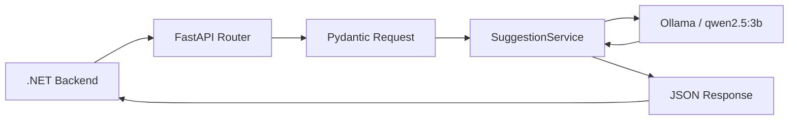

# AI Translation Service

A FastAPI service that generates translation suggestions for Translation Management Platform using Ollama and **`qwen2.5:3b`**. The .NET backend calls it for single and batch suggestions.

[Project overview](../../README.md) · [Backend](../backend/README.md) · [Frontend](../../apps/web/README.md)

## 1. Scope and technology

- Python 3.10+, FastAPI, Uvicorn, and Pydantic.
- Ollama Python client and Ollama server.
- Model defined in `app/services/suggestion_service.py`: `qwen2.5:3b`.
- Translates a single string or dictionary values while retaining keys for result mapping.
- Prompts request placeholder preservation; output is not automatically validated for that requirement.

The service generates suggestions. It does not access PostgreSQL, publish releases, or replace the review process.

## 2. Processing flow



For batches, the service requests JSON, parses the response, keeps matching input keys, and accepts string values only. It retries missing keys once. The final response may still contain fewer keys than the input.

## 3. Structure

```text
services/ai-translation/
├── app/
│   ├── main.py                       # FastAPI app, router, health
│   ├── routers/suggestion.py         # HTTP endpoints
│   ├── schemas/suggestion.py         # Request/response models
│   └── services/suggestion_service.py # Prompts, Ollama, parsing/retry
├── requirements.txt
└── README.md
```

## 4. Installation and startup

Run from `services/ai-translation`:

```powershell
python -m venv .venv
.\.venv\Scripts\Activate.ps1
python -m pip install -r requirements.txt
python -m pip install ollama
```

The extra `ollama` installation is required because the code imports it but `requirements.txt` does not declare it. The requirements file also includes `google-genai`, while the current suggestion implementation uses Ollama.

Download the model:

```powershell
ollama pull qwen2.5:3b
```

Ensure the Ollama server is running. If it is not already started by the Ollama application, run `ollama serve` in a separate terminal. Then start FastAPI:

```powershell
uvicorn app.main:app --reload --port 8000
```

- Swagger: `http://localhost:8000/docs`.
- OpenAPI: `http://localhost:8000/openapi.json`.
- Health: `http://localhost:8000/health`.

Use `--host 0.0.0.0` and an appropriate port when the host needs to accept connections beyond loopback. The model is currently selected in source code, without a dedicated application setting for model selection.

## 5. API

### `GET /health`

```json
{"status":"healthy"}
```

This confirms that FastAPI responds. It does not confirm Ollama connectivity or model availability.

### `POST /api/review/suggest`

Request:

```json
{
  "source_text": "Hello {name}",
  "source_language": "en-US",
  "target_language": "fr-FR",
  "context": "common.greeting"
}
```

Illustrative response; actual output depends on the model:

```json
{"suggestion":"Bonjour {name}"}
```

`context` is optional. The router passes it to the service, but the current prompt does not use it.

### `POST /api/review/suggest-batch`

Request:

```json
{
  "source_language": "en-US",
  "target_language": "fr-FR",
  "data": {
    "auth.login": "Log in",
    "common.cancel": "Cancel"
  }
}
```

Illustrative response:

```json
{
  "suggestions": {
    "auth.login": "Se connecter",
    "common.cancel": "Annuler"
  }
}
```

`data` and `suggestions` are string-to-string dictionaries. An empty batch returns an empty dictionary. Responses are JSON objects with `suggestion` or `suggestions` fields, not plain text.

## 6. Backend integration

Configure the Management API:

```powershell
$env:AI__BaseUrl = 'http://localhost:8000'
```

The backend's `TranslationSuggestionService` calls the two endpoints above. In Docker, use an address reachable from the API container: container `localhost` is not the host machine. Root Compose does not start AI/Ollama.

## 7. Manual checks

```powershell
Invoke-RestMethod -Uri 'http://localhost:8000/health'

$body = @{
    source_text = 'Hello'
    source_language = 'en-US'
    target_language = 'fr-FR'
} | ConvertTo-Json

Invoke-RestMethod -Uri 'http://localhost:8000/api/review/suggest' -Method Post -ContentType 'application/json; charset=utf-8' -Body ([System.Text.Encoding]::UTF8.GetBytes($body))
```

Also check unavailable models, multi-key batches, placeholders, missing keys, and invalid generated JSON. There is no dedicated automated test suite in this service directory yet.

## 8. Error behavior and limitations

| Situation | Current behavior |
| --- | --- |
| Invalid request schema | FastAPI/Pydantic validation error |
| Single translation failure | String beginning with `[AI Error]`, followed by the source text |
| Batch failure or invalid generated JSON | Empty dictionary |
| Missing batch keys | One retry; results may remain incomplete |

Because exceptions can produce fallback values, HTTP 200 does not always mean translation succeeded. Clients must inspect the response content.

`ollama.chat` is synchronous even though the surrounding methods are `async`, so inference can block the event loop. The service currently has no separate authentication layer. Output language, placeholders, and translation accuracy are not automatically verified. The single-string prompt currently prohibits Vietnamese output and needs adjustment before using Vietnamese as the target language.
