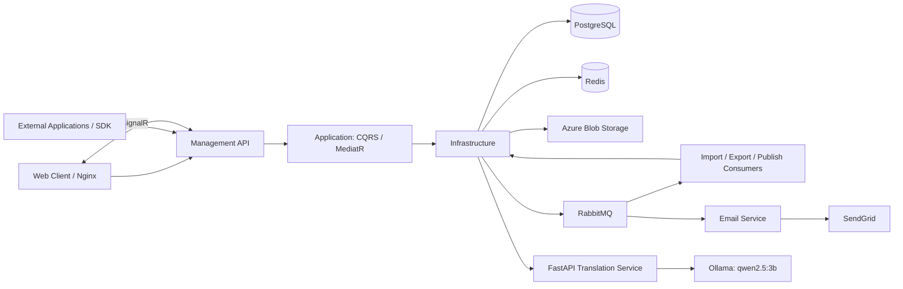
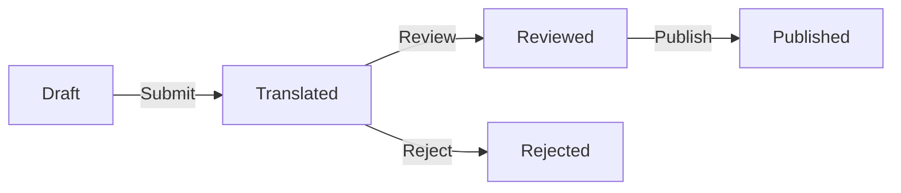

# Translation Management Platform — Backend

[Project overview](../../README.md) · [Frontend](../../apps/web/README.md) · [AI](../ai-translation/README.md) · [Translation Read demo](../../examples/translation-read/README.md)

The .NET backend for managing, reviewing, publishing, and distributing multilingual content to internal enterprise applications.

**Author:** Trần Khiết Lôi

**Documentation scope:** `services/backend` and its integrations within this monorepo.

## 1. Overview

Translation Management Platform centralizes translation data. Development teams and translators manage projects, languages, members, namespaces, keys, and language-specific values, then review and publish content for external applications through API Keys.

Capabilities:

- Account, profile, role, and permission management.
- Project, member, and language management.
- Namespace → translation key → translation value organization.
- Translation grids with search, status filters, and pagination.
- Editing, submission, approval/rejection, and batch operations.
- JSON, CSV, and XLSX import/export.
- Versioned releases, history, comparison, and rollback.
- API Keys for translation access, version checks, and package delivery.
- Azure Blob file storage, email, and in-application notifications.
- Queued import/export/publish work and SignalR updates.
- Single/batch AI suggestions through FastAPI, Ollama, and `qwen2.5:3b`, including the Vietnamese-source translation workflow.

## 2. Technology stack

| Area | Technology | Purpose |
| --- | --- | --- |
| Runtime and HTTP | .NET 10, ASP.NET Core | APIs and application hosts |
| Architecture | Clean Architecture, CQRS, MediatR | Layer boundaries and business request handling |
| Data | PostgreSQL, EF Core, Npgsql | Persistence and queries |
| Data access | Repository Pattern, Unit of Work | Repositories, persistence, transactions |
| Migrations | DbUp, SQL scripts | Database creation and schema upgrades |
| Validation | FluentValidation | Input validation through request pipelines |
| Authentication | JWT, refresh tokens | Login sessions |
| Authorization | Roles and permissions | User actions and API Key permissions |
| Cache and coordination | Redis, StackExchange.Redis, RedLock.net | Permissions, token blacklist, security stamps, distributed locks |
| Messaging | RabbitMQ, MassTransit | Background jobs and email events |
| Realtime | SignalR | Notifications, presence, editing locks, publish progress |
| Files | Azure Blob Storage | Imports/exports, release packages, related files |
| Email | SendGrid, Scriban | Template-based email delivery |
| Observability | Serilog, Audit Log, Usage Log | Requests, changes, API Key usage |
| AI | Python/FastAPI, Ollama, Qwen 2.5 3B | Translation suggestions over HTTP |
| Hosting | Docker, Docker Compose, Nginx | Packaging and reverse proxy |
| Tests | xUnit, Moq | Business handler unit tests |

## 3. Architecture



Layer responsibilities:

- **Domain:** business entities and enums.
- **Application:** commands/queries, handlers, validators, interfaces, and DTOs.
- **Infrastructure:** EF Core, repositories, authentication, caching, storage, consumers, and external integrations.
- **API:** controllers, middleware, authentication/authorization registration, Swagger, and SignalR hosting.

Email has a separate host. Import/export/publish consumers are currently registered inside the Management API, rather than deployed as an independent worker. AI is outside the .NET solution and communicates over HTTP.

## 4. Source structure

```text
services/backend/
├── MySolution.slnx
├── Management/
│   ├── MySolution.Api/                 # HTTP API, middleware, authorization
│   ├── MySolution.Application/         # CQRS, handlers, validators, interfaces
│   ├── MySolution.Domain/              # Entities and enums
│   └── MySolution.Infrastructure/      # Persistence, cache, queues, storage, realtime
├── Email/
│   ├── MySolution.Email.Api/           # Email service host
│   ├── MySolution.Email.Application/   # Email business logic
│   └── MySolution.Email.Infrastructure/ # SendGrid and email integrations
├── MySolution.Migration/               # DbUp and SQL scripts
├── Shared/                            # Message contracts and shared components
└── Tests/
    ├── AuthService.UnitTests/
    └── EmailService.UnitTests/
```

Related root directories include `apps/web`, `services/ai-translation`, `infra`, `examples/translation-read`, `examples/package-download`, and `tools/load-tests`.

## 5. Business workflows

### 5.1. Authentication and authorization

- Registration assigns the default role, creates a profile, and sends a verification email.
- Login checks account status,  and email verification.
- JWT and refresh tokens are issued; refresh-token hashes are stored in the database.
- The controller sets the refresh token in an `HttpOnly`, `Secure`, `SameSite=Lax` cookie.
- Refresh, logout, password change, forgot- and reset-password flows are supported.
- Password reset checks token expiry and `PasswordVersion`; changing the password increments the version, invalidating older reset tokens.
- Redis stores token blacklists, security stamps, and permission caches.
- Roles/permissions control business endpoints; API Keys have a separate external-application authorization flow.
- HTTP and authentication operations have rate-limit configuration.

### 5.2. Project and translation management

```text
Project
├── Members
├── Languages
└── Namespaces
    └── Translation Keys
        └── Translation Values per language
```

This structure scopes content to a project, groups keys by function, and supports language-completion tracking. APIs manage projects, languages, members, namespaces, keys, and values.

### 5.3. Translation grid and filtering

The grid combines data for multilingual editing. Its query supports `ProjectId`, `NamespaceId`, `Keyword`, `Status`, `NumberOfLanguages`, `PageNumber`, and `PageSize`.

Additional APIs provide pending review lists, batch updates/reviews, and pending counts by namespace/language. Pagination and scoped queries avoid requiring the entire project in a single UI request.

### 5.4. Review workflow



This diagram shows the main workflow, not an exhaustive state-transition specification. The enum includes `Missing`, `Draft`, `Translated`, `Rejected`, `Reviewed`, and `Published`; `Missing` represents absent translations.

Publishing selects values with `Reviewed` or `Published` status and changes included `Reviewed` values to `Published`.

### 5.5. API Key management and SDK

- Manage external applications and their API Keys.
- Assign permissions; rotate and revoke keys.
- Validate keys and access scope before returning data.
- Accept keys through the `X-API-KEY` header.
- Provide translation, version, and package endpoints.
- Record usage through Usage Log.

External applications consume published data. The active release determines the version served to integrations.

### 5.6. Translation import/export

Format-specific parsers/generators handle JSON, CSV, and XLSX, selected through factories.

```text
Client request → API creates a job and sends a message → RabbitMQ
→ Consumer processes data/files → Save results and update status
```

Import/export services use Azure Blob Storage. Queuing separates processing time from the initiating request. Import/export/publish receive endpoints configure three retries at five-second intervals and a concurrent message limit of five per endpoint.

### 5.7. Publishing, versioning, and rollback

- Releases record their version, publisher, and publication time.
- Translation data is packaged for downloads and application integrations.
- Release history and comparison APIs expose differences between versions.
- The publish consumer uses a Redis distributed lock to coordinate work per project.
- SignalR reports publish progress.
- Rollback activates the selected release and deactivates the current one within a transaction.

Rollback changes the served release; it does not restore all working translation data to an earlier point in time.

### 5.8. Redis and caching

Redis supports permission caching, token blacklists, security stamps, and distributed locks. These reduce repeated permission lookups, support session validation, and coordinate publishing.

Realtime presence and editing locks currently use in-process `ConcurrentDictionary` instances. They are not shared through Redis across multiple API instances.

### 5.9. Realtime processing

The SignalR hub is exposed at `/hubs/translation` and supports:

- Joining/leaving project groups and updating online users.
- Locking/unlocking translation values during editing.
- Broadcasting typing updates to related clients.
- Delivering application notifications and publish progress.

Events include `OnlineUsersUpdated`, `TranslationLocked`, `TranslationUnlocked`, `LockFailed`, `UserTyping`, `NotificationReceived`, and `PublishProgress`.

Clients use these events to update UI state, show active editors, and display progress. UI locks do not replace backend authorization or validation.

### 5.10. Email, logging, and auditing

Email Service consumes RabbitMQ messages, renders Scriban templates, and sends email through SendGrid for workflows such as verification and password setup/recovery.

Serilog tracks requests and application errors. Audit Log records business activity; Usage Log tracks API Key use. These support different operational and traceability needs.

### 5.11. AI translation suggestions

The backend calls FastAPI through `AI:BaseUrl`, using `/api/review/suggest` and `/api/review/suggest-batch`. The current AI model is `qwen2.5:3b`, defined in `services/ai-translation/app/services/suggestion_service.py`.

Suggestions use source content and the target language. The API accepts `context`, but the AI service does not yet include it in the prompt. AI output supports editing; review and publication remain part of the business workflow.

## 6. API groups

| Group | Representative paths | Purpose |
| --- | --- | --- |
| Authentication | `/api/Auth` | Registration, login, refresh, logout, verification, passwords, me |
| Accounts/profiles | `/api/User`, `/api/UserProfile` | Users, roles, profiles |
| Authorization | `/api/Role`, `/api/Permission` | Roles and permissions |
| Projects | `/api/Project` | Projects, namespaces, languages, members |
| Languages | `/api/Language` | Language catalog |
| Translation content | `/api/TranslationKey`, `/api/TranslationValue` | Keys and values |
| Editing/review | `/api/TranslationManagement` | Grid, submit, review, reject, batch, AI suggestions |
| Pipeline | `/api/TranslationPipeline` | Import, export, publish, history, diff, rollback |
| Integrations | `/api/Application`, `/api/ApiKey` | Applications and keys |
| SDK | `/api/sdk/projects/translations` | Read translations |
| SDK | `/api/sdk/projects/version`, `/api/sdk/projects/package` | Version and package |
| Operations | `/api/Dashboard`, `/api/AuditLog`, `/api/Notification`, `/api/File` | Overview, logs, notifications, files |
| Realtime | `/hubs/translation` | SignalR |

Management API Swagger defines methods, requests, responses, and parameters. This table is a functional map, not a replacement for the API contracts.

## 7. Environment configuration

Hosts load `appsettings.json`, environment-specific configuration, and environment variables. Replace `:` with `__` for .NET environment variables.

| Configuration key | Purpose |
| --- | --- |
| `ConnectionStrings:DefaultConnection` | Application PostgreSQL connection |
| `ConnectionStrings:mysolution` | Migration PostgreSQL connection |
| `CreateNewDatabase` | Allow migration to create the database outside Production |
| `Jwt:Issuer`, `Jwt:Audience`, `Jwt:SecretKey` | JWT settings |
| `Jwt:ExpireMinutes`, `Jwt:RefreshTokenDays` | Token lifetimes |
| `TokenOptions:*` | Verification/reset-token lifetimes |
| `RefreshTokenCleanup:*` | Refresh-token cleanup |
| `Redis:ConnectionString` | Redis connection |
| `RabbitMq:Host`, `RabbitMq:Username`, `RabbitMq:Password` | RabbitMQ connection |
| `AzureBlob:ConnectionString`, `AzureBlob:ContainerName` | Blob Storage |
| `SendGrid:ApiKey`, `SendGrid:FromEmail`, `SendGrid:FromName` | Required Email Service startup and delivery settings |
| `Frontend:BaseUrl` | Frontend links |
| `CorsAllowedOrigins` | Allowed frontend origins |
| `AI:BaseUrl` | FastAPI address |
| `HttpRateLimit:*` | Request limits |
| `Logging:*` | Logging configuration |

**RabbitMQ key naming:** the options class uses `Host`, while some current settings files use `HostName`. Set `RabbitMq:Host` or `RabbitMq__Host` correctly for both Management API and Email Service.

PowerShell example; replace placeholders with local settings:

```powershell
$env:ConnectionStrings__DefaultConnection = 'Host=localhost;Port=5432;Database=mysolution_db;Username=<db-user>;Password=<db-password>;Search Path=mysolution'
$env:Redis__ConnectionString = 'localhost:6379'
$env:RabbitMq__Host = 'localhost'
$env:RabbitMq__Username = '<rabbitmq-user>'
$env:RabbitMq__Password = '<rabbitmq-password>'
$env:AI__BaseUrl = 'http://localhost:8000'
$env:Jwt__SecretKey = '<jwt-signing-secret>'
```

This is only a subset of configuration. Provide full JWT, Blob, frontend, and email settings as required by each host. Separate terminals need the appropriate environment. Do not add real secrets to documentation or new commits.

## 8. Local development

Run commands from the repository root unless a directory change is explicitly shown.

### 8.1. Prerequisites

- .NET SDK 10 and PostgreSQL connection settings.
- Redis and RabbitMQ, optionally through Docker Desktop/Compose.
- Azure Blob Storage and SendGrid for file/email features.
- Python, AI dependencies, and Ollama for translation suggestions.

### 8.2. Start local infrastructure

```powershell
docker compose -f infra/compose.yaml up -d
```

This starts Redis, RabbitMQ, and RedisInsight. PostgreSQL, Azure Blob, SendGrid, and AI require separate configuration.

| Component | Local address |
| --- | --- |
| Redis | `localhost:6379` |
| RabbitMQ AMQP | `localhost:5672` |
| RabbitMQ Management | `http://localhost:15672` |
| RedisInsight | `http://localhost:5540` |

### 8.3. Restore and build

```powershell
dotnet restore services/backend/MySolution.slnx
dotnet build services/backend/MySolution.slnx --no-restore
```

### 8.4. Database initialization/upgrades

Migrations use DbUp and SQL scripts. Run from the migration project directory so the application reads the correct `appsettings.json`:

```powershell
Push-Location services/backend/MySolution.Migration
$env:ConnectionStrings__mysolution = 'Host=localhost;Port=5432;Database=mysolution_db;Username=<db-user>;Password=<db-password>;Search Path=mysolution'
$env:CreateNewDatabase = 'true'
$env:ASPNETCORE_ENVIRONMENT = 'Development'
dotnet run --project MySolution.Migration.csproj -- mysolution
Pop-Location
```

Use `all` to run every database defined by the program. Script groups run in order: `Sequences → Scripts → Functions → Alter → Seed`, with a transaction per script and execution tracking in `public.schema_version`. The seed runs as part of the migration; no separate seed command is needed. Check the `Migration SUCCESS`/`Migration FAILED` logs. For the Docker SDK alternative and initial development accounts, see the [root setup guide](../../README.md#step-4-create-the-database-and-seed-data).

### 8.5. Management API and Email Service

Use separate terminals with the required environment:

```powershell
dotnet run --project services/backend/Management/MySolution.Api/MySolution.Api.csproj --launch-profile http
```

```powershell
dotnet run --project services/backend/Email/MySolution.Email.Api/MySolution.Email.Api.csproj --launch-profile http
```

- Management API: `http://localhost:5182`; Swagger: `http://localhost:5182/swagger`.
- Email host: `http://localhost:5188`; primarily a message-processing host. Its current `Program.cs` does not enable Swagger/controllers.
- The API HTTPS profile uses `https://localhost:7179`. Use HTTPS and compatible CORS/origin configuration when testing `Secure` refresh cookies.

### 8.6. Optional AI service

```powershell
ollama pull qwen2.5:3b
```

Ensure Ollama is running. In another terminal:

```powershell
Set-Location services/ai-translation
python -m venv .venv
.\.venv\Scripts\Activate.ps1
python -m pip install -r requirements.txt
uvicorn app.main:app --reload --port 8000
```

Point the API's `AI:BaseUrl` at FastAPI. The Ollama Python client is included in `requirements.txt`. See the [AI README](../ai-translation/README.md) for contracts and limitations.

## 9. Run with Docker

Root `compose.yaml` builds and starts Redis, RabbitMQ, API, Email, Web, Ollama, the AI service, and the Translation Read demo together:

```powershell
docker compose up -d --build
```

See the [project README](../../README.md#6-run-from-a-fresh-clone) for the one-time setup, full service list, and addresses. `infra/compose.yaml` starts only Redis/RabbitMQ/RedisInsight for local (non-Docker) backend development.

To build just one .NET image:

```powershell
docker build -f services/backend/Management/MySolution.Api/Dockerfile -t translation-api:local services/backend
docker build -f services/backend/Email/MySolution.Email.Api/Dockerfile -t translation-email:local services/backend
```

Root Compose does not declare PostgreSQL; provide a reachable connection string. Use container-network addresses (service names, not `localhost`) between containers. Nginx configuration is in `apps/web/nginx.conf`. See the [Docker guide](../../docs/docker.md) for troubleshooting.

## 10. Testing

Authentication tests:

```powershell
dotnet test services/backend/Tests/AuthService.UnitTests/AuthService.UnitTests.csproj
```

Entire solution:

```powershell
dotnet test services/backend/MySolution.slnx
```

The most recent Auth test run passed 19 cases covering:

- **Login:** missing/inactive/blocked users, wrong password, unverified email, exceptions, successful login with complete/incomplete profiles, tokens, JTI, security stamps, and persistence.
- **Register:** duplicate details, missing default role, exceptions, successful user/role/profile creation, and verification email content.
- **ResetPassword:** expired tokens, missing users, invalid `PasswordVersion`, exceptions, password hashes/version increments, and account status.

`Helpers/AsyncQuery.cs` supports mocked EF Core async queries. These are handler unit tests, not SQL or PostgreSQL/Redis/RabbitMQ/Blob/SendGrid integration tests. `EmailService.UnitTests` still contains an empty placeholder test.

## 11. Current scope and future work

The backend implements management, editing, review, release, and delivery workflows with email, realtime, and AI integrations. Further work includes:

- Integration tests for databases, queues, caches, storage, publishing, and rollback.
- Broader business test coverage and real Email Service tests.
- Shared presence/editing-lock state and SignalR configuration for multiple instances.
- Standardized environment configuration, health checks, and deployment procedures.
- Retry/idempotency and background-failure handling at larger scale.
- Dependency warning remediation, including `NU1903` for `System.Security.Cryptography.Xml 8.0.2` in the most recent test build.

Commands and architecture descriptions were checked against source code. Passing unit tests does not establish full integration coverage or production readiness.

## Private configuration

Sensitive settings in the tracked JSON files are empty. For `dotnet run`, supply your own settings through environment variables in the matching terminal. Root Compose uses ignored `infra/docker/*.local.json` files. Follow the [private configuration instructions](../../docs/deployment.md#private-local-configuration); never commit real credentials. The Email host validates its SendGrid API key and sender settings on startup. For a limited trial without email, use the verified seed accounts and the service list in the [root setup guide](../../README.md#step-5-build-and-start-the-services).
